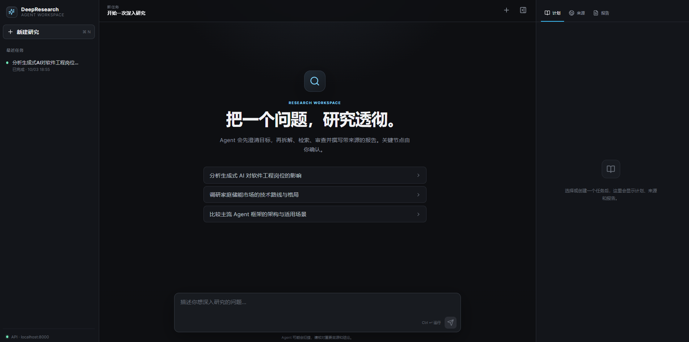
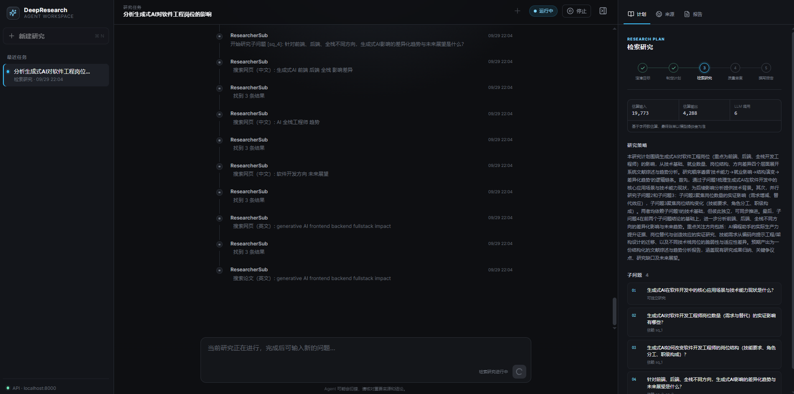
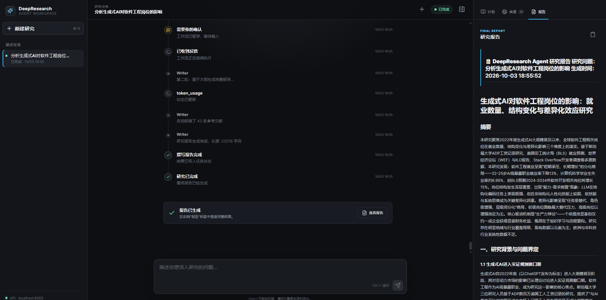

# DeepResearch Agent

> 带可视化 Web 工作区的多 Agent 深度研究系统：从意图澄清、任务规划、并行检索、质量审查到报告生成，全流程实时可见，并输出带来源的结构化研究报告。

DeepResearch Agent 将复杂问题拆解为相互关联的子问题，由多个 Researcher Sub-Agent 并行完成网页与学术检索，再通过两级 Critic 审查和交互式 Writer 生成最终报告。除了命令行模式，项目还提供基于 **Next.js + FastAPI + SSE** 的三栏研究工作区，可实时查看执行过程、研究计划、引用来源和最终报告。

## 主要能力

- **可视化研究工作区**：统一管理历史任务，实时展示 Agent 执行轨迹、阶段状态与 Token 用量
- **关键节点人工确认**：支持研究目标澄清和报告大纲审核，确认后从暂停点继续运行
- **多 Agent 并行研究**：根据依赖关系拓扑调度子问题，并自动传递上游研究结果
- **来源与报告分栏查看**：集中展示去重后的网页、论文来源，并支持 Markdown 报告预览与复制
- **质量控制与自动补研**：逐子问题审查与整体一致性审查结合，只重试未达标部分
- **多提供者可切换**：支持 OpenAI、DeepSeek、Qwen、vLLM 及多种网页和学术搜索服务

---

## 界面预览

### 1. 创建研究任务

在首页输入需要深入研究的问题，也可以直接选择示例问题开始。左侧用于管理研究任务，右侧会随任务进度展示计划、来源和报告。



### 2. 实时查看研究过程

研究运行期间，主工作区会持续输出 Agent 执行事件；右侧同步展示当前阶段、Token 用量、研究策略以及子问题之间的依赖关系。



### 3. 查看最终研究报告

研究和审查完成后，可在右侧“报告”面板直接阅读或复制完整 Markdown 报告，并在“来源”面板核对引用材料。



---

## 架构总览

```
用户问题
  │
  ▼
┌───────────┐  分析模糊点、缺失上下文，生成澄清问题
│ Clarifier │  ── CLI 交互获取用户回答 → 整合为结构化意图描述
└─────┬─────┘
      │
      ▼
┌───────────┐  拆解问题 + 提取中英文关键词 + 制定研究计划
│  Planner  │  ── 参考历史研究记录，避免重复搜索
└─────┬─────┘
      │
      ▼
┌─────────────────────────────────────────────┐
│              Orchestrator (主控调度)          │
│                                              │
│  依赖分析 → 拓扑排序 → 并行调度 Sub-Agent    │
│  前置子问题发现自动传递 + 动态追加子问题      │
│  搜索关键词缓存去重 + 语义重叠检测           │
│                                              │
│  ┌───────────┐ ┌───────────┐ ┌───────────┐  │
│  │ Sub-Agent1│ │ Sub-Agent2│ │ Sub-Agent3│  │
│  │ 网页搜索  │ │ 网页搜索  │ │ 网页搜索  │  │
│  │ 论文搜索  │ │ 论文搜索  │ │ 论文搜索  │  │
│  │ LLM 整合  │ │ LLM 整合  │ │ LLM 整合  │  │
│  └─────┬─────┘ └─────┬─────┘ └─────┬─────┘  │
│        │              │              │        │
│        └──────────────┼──────────────┘        │
│                       ▼                       │
│              结果汇总 + 上下文传递             │
└───────────────────────┬─────────────────────┘
                        │
                        ▼
┌───────────┐  第一级：逐子问题评分，精确定位不合格 Sub-Agent
│  Critic   │  ── 第二级：整体一致性评分，检查跨子问题逻辑
│ (两级审查) │  ── 选择性重试：只重新执行不达标的子问题
└─────┬─────┘
      │ 通过
      ▼
┌───────────┐  第一轮：生成大纲 → 用户审核 → 修改建议
│  Writer   │  ── 第二轮：大纲 + 建议 + 数据 → 完整报告
│(两轮交互式)│
└───────────┘
```

---

## 关键技术

### 1. 自研 DAG 引擎

**0 个外部工作流依赖**，自研 DAG 引擎驱动整个研究流程：

- **节点 + 条件边**：每个 Agent 是独立节点，Critic 后通过条件边决定走向（通过→Writer，未通过→Orchestrator 重试）
- **拓扑并发**：支持 fan-out / fan-in，Orchestrator 的并行调度基于此实现
- **执行快照**：可断点续跑和调试
- **最大步数限制**：防止条件边导致的无限循环

### 2. Orchestrator 智能调度

Orchestrator 是系统的调度核心，根据子问题依赖关系构建执行 DAG，实现拓扑排序 + 并行调度：

| 机制 | 说明 |
|------|------|
| 拓扑排序 | 解析 `depends_on` 依赖关系，确定执行层级（同层并行，不同层串行） |
| 并行调度 | 同层无依赖的子问题通过 `asyncio.gather + Semaphore` 并发执行 |
| 上下文传递 | 前置子问题的 findings 自动作为后续子问题的输入上下文 |
| 动态调整 | 每层完成后可选调用 LLM 判断是否需要追加子问题 |
| 回退兼容 | 子问题数 ≤ 1 或依赖解析失败时自动回退到串行 Researcher |

#### 动态追加子问题

每层执行完后，Orchestrator 可选调用 LLM 判断是否需要追加子问题。核心设计：新子问题不直接追加到最后一层，而是与剩余子问题合并后**重新拓扑排序**，确保根据 `depends_on` 被放置到正确层级。同时使用 `while` 循环替代 `for` 循环，使每一层（包括最后一层）执行完后都可以触发动态调整。

#### 子问题三重去重

并行调度场景下，多个 Sub-Agent 可能搜索相同关键词或研究相似子问题：

1. **搜索关键词缓存**：同层 Sub-Agent 共享 `search_cache`，相同关键词直接命中缓存，跨层复用
2. **语义重叠检测**：计算关键词 Jaccard 相似度（`keywords_zh + keywords_en`）与文本 Jaccard 相似度（英文单词 + 中文 bigram），取最大值 ≥ 阈值（默认0.5）则过滤
3. **提示词约束**：Planner 和 Orchestrator 的 Prompt 内置去重规则，从源头减少重复

### 3. 两级评审 + 选择性重试

Critic Agent 采用两级评审机制，实现精准质量把控：

**第一级：逐子问题评分** —— 精确定位"哪个 Sub-Agent 不合格"

| 维度 | 分值 | 审查重点 |
|------|------|----------|
| 事实准确性 | 30 | 断言是否有来源支撑？是否存在无依据的数据和结论？ |
| 逻辑一致性 | 20 | 论点之间是否矛盾？推理链条是否完整？ |
| 信息完整性 | 20 | 子问题是否被充分覆盖？是否有重要遗漏？ |
| 来源充分性 | 15 | 每个论点是否有足够多的独立来源支撑？ |
| 时效性 | 15 | 信息是否为最新？是否引用了过时的研究？ |

三级判定：**≥70** 通过 → Writer | **50-69** 有条件通过 → 附审查意见 | **<50** 未通过 → 选择性重试

**第二级：整体一致性评分** —— 检查子问题之间的逻辑一致性、信息覆盖完整性、结论是否相互支撑

**选择性重试**：Orchestrator 只重新执行评分不达标的子问题，保留合格结果。重试时 Critic 只对重试的子问题增量评审，已通过的不再重复。

### 4. 渐进式上下文压缩

ContextManager 根据上下文使用率分级触发不同压缩策略，而非等到超限才处理：

```
  0%          60%         80%         100%
  ├────────────┼───────────┼───────────┤
  │  正常运行   │  轻量压缩  │  深度压缩  │ >100% 紧急 + 强制收缩
  │            │  (去重/    │  (LLM语义 │  (摘要+
  │            │   修剪)    │   摘要)   │   硬截断兜底)
  └────────────┴───────────┴───────────┘
```

- **60% 水位**：非关键内容去重、超长修剪（关键信息原样保留）
- **80% 水位**：调用 LLM 对早期内容做语义摘要
- **100% 水位**：紧急摘要 + `_force_shrink()` 强制收缩，保证一定不超过模型窗口

**`is_key` 的语义（重要）**：`add_context(..., is_key=True)` 表示"小而不可再生的关键事实"（用户意图澄清、研究计划），它享有**最高保留优先级**——不去重、不修剪、不丢弃、不摘要，并通过 `get_key_info()` 注入 Critic / Writer 的 prompt，确保研究不偏离用户真实意图。但它是优先级而非绝对不可压缩：当分级压缩后仍然超限时，`_force_shrink()` 会把关键信息一并降级为摘要或硬截断，避免上下文无限增长、反复进入紧急压缩却毫无效果。

因此**体积大且能从 state 重新取得的内容不应标记为关键信息**：研究发现（`findings`）体积最大，且在 `state["findings"]` 中已有同一份内容，所以工作流以 `is_key=False` 写入，让它真正参与压缩；重复注入下游 prompt 只会浪费 token。上下文中的条目统一使用 `role="system"`，表示"由上游阶段注入的事实"，避免被当成模型自己先前的断言。`ContextManager` 的会话隔离由 `ResearchWorkflow.run()` 开头的 `clear()` 保证。

每个压缩场景都有定制化指令：搜索结果保留标题和核心发现、论文保留引用次数和年份、研究发现保留核心论点、审查反馈保留具体问题和修正建议。`max_tokens` 根据实际使用的 LLM 模型动态调整（通过 `MODEL_CONTEXT_WINDOWS` 映射表自动适配）。

### 5. 向量记忆与会话隔离

使用 ChromaDB 构建持久化向量记忆系统（MemoryManager）：

- **3 种记忆类型**：`research`（完整研究记录）、`search_results`（搜索缓存）、`papers`（论文缓存）
- **历史自动检索**：新研究开始时，Planner 自动检索相关历史研究记录作为参考上下文
- **会话级隔离**：通过 session_id 实现记忆隔离，不同会话的记忆互不可见

### 6. 三维度自动评估

评估系统对生成的研究报告进行自动化质量评估，**3 个维度 × 独立评分**：

| 维度 | 方法 | 评分 | 量化指标 |
|------|------|------|----------|
| 质量 | LLM 五维度评分 | 0-4 分 | 全面性 + 连贯性 + 清晰度 + 洞察力 + 总体 |
| 重复性 | 随机段落对 LLM 评分 | 0-4 分 | 采样 30 对，4=无重复，0=过度重复 |
| 事实核查 | Jina 抓取 + LLM 逐句判断 | -1/0/1 | 支持率 = supported / total |

事实核查优化：同句多源合并为单次 LLM 调用 → 超限随机采样（默认 30 句），节省LLM调用次数。支持 3 种评估模式（单文件 / 批量断点续传 / 交互式）。

### 7. 全链路可切换，零代码改动

3 个维度，Factory 模式实现配置切换：

| 维度 | 提供者 | 配置项 |
|------|--------|--------|
| LLM | OpenAI / DeepSeek / vLLM / Qwen | `LLM_PROVIDER` |
| 搜索引擎 | Tavily / SerpAPI / Bing / Bocha | `SEARCH_PROVIDER` |
| 学术搜索 | Arxiv / Semantic Scholar / OpenAlex | `ACADEMIC_PROVIDER` |

DeepSeek、vLLM、Qwen 均采用 OpenAI 兼容协议，复用 OpenAI 客户端实现。可以先用低成本 API 开发调试，再切换到高质量模型生成最终报告，或部署本地 vLLM 实现完全离线运行。

---

## 目录结构

```
deepresearch_agent/
├── agents/                     # Agent 实现
│   ├── base_agent.py           # Agent 基类（含 context_manager 支持）
│   ├── clarifier_agent.py      # 意图澄清 Agent（模糊点识别 + CLI 交互）
│   ├── planner_agent.py        # 规划 Agent（问题拆解 + 关键词提取 + 历史参考）
│   ├── orchestrator_agent.py   # 主控调度 Agent（拓扑排序 + 并行调度 + 动态调整 + 去重）
│   ├── researcher_agent.py     # 研究 Agent（串行回退模式）
│   ├── researcher_sub_agent.py # 研究 Sub-Agent（单子问题执行，被 Orchestrator 调度）
│   ├── critic_agent.py         # 审查 Agent（两级评审 + 选择性重试）
│   └── writer_agent.py         # 写作 Agent（两轮交互式写作）
├── llm/                        # 4 个 LLM 提供者（Factory 模式）
│   ├── base_llm.py / openai_llm.py / deepseek_llm.py / vllm_llm.py / qwen_llm.py
│   └── llm_factory.py
├── search/                     # 4 个搜索引擎（Factory 模式）
│   ├── base_search.py / tavily_search.py / serpapi_search.py / bing_search.py / bocha_search.py
│   └── search_factory.py
├── academic/                   # 3 个学术搜索（Factory 模式）
│   ├── base_academic.py / arxiv_search.py / semantic_scholar.py / openalex_search.py
│   └── academic_factory.py
├── memory/                     # 记忆系统
│   ├── vector_store.py         # ChromaDB 向量存储（session_id 会话隔离）
│   ├── memory_manager.py       # 长期记忆管理器（3 种记忆类型）
│   └── context_manager.py      # 短期上下文压缩器（3 级渐进压缩）
├── workflows/                  # 自研 DAG 引擎
│   ├── state.py                # ResearchState + SubQuestion + SubQuestionResult
│   ├── dag_engine.py           # DAG 引擎（拓扑并发 + 条件路由 + 执行快照）
│   └── research_workflow.py    # 完整研究工作流
├── api/                        # FastAPI 服务层（不改写 Agent 核心逻辑）
│   ├── main.py                 # REST + SSE API 入口
│   ├── run_manager.py          # 任务状态、结构化事件、暂停/恢复
│   └── schemas.py              # API 请求和响应模型
├── frontend/                   # TypeScript + Next.js 前端
│   ├── app/                    # 三栏 Codex 风格工作区
│   └── lib/                    # API 客户端和类型契约
├── prompts/                    # 5 组 Prompt 模板
├── evaluation/                 # 评估模块（质量评估 + 重复性评估 + 事实核查）
│   ├── evaluator.py            # 统一评估器（整合三个子评估器）
│   ├── quality_evaluator.py    # 质量评估器（5 维度 0-4 分）
│   ├── repeatability_evaluator.py # 重复性评估器（段落对 0-4 分）
│   ├── fact_evaluator.py       # 事实核查评估器（Jina 抓取 + LLM 判断）
│   ├── prompts.py              # 评估提示词模板
│   ├── convert_to_jsonl.py     # 报告转 JSONL 工具
│   ├── run_evaluation.py       # 评估入口脚本（3 种模式）
│   └── README.md               # 评估系统详细文档
├── outputs/                    # 报告输出目录
├── tests/                      # 7 个测试文件（test_context_compression.py 为离线回归测试）
├── config.py                   # 60+ 可配置参数（pydantic-settings）
├── main.py                     # 入口文件
├── requirements.txt            # 依赖清单
└── .env.example                # 环境变量模板
```

## 技术栈

| 技术 | 用途 |
|------|------|
| Python 3.11+ | 开发语言 |
| FastAPI + SSE | 任务 API、实时事件流、人机交互恢复 |
| TypeScript + Next.js | Web 工作区（三栏任务、过程、产物界面） |
| 自研 DAG Engine | 工作流引擎（0 外部依赖，节点+条件边+拓扑并发+执行快照） |
| Pydantic / pydantic-settings | 数据验证 + 60+ 配置项强类型管理 |
| ChromaDB | 向量存储（3 种记忆类型 + 会话隔离） |
| httpx | 异步 HTTP 客户端 |
| python-dotenv | 环境变量加载 |

---

## 快速开始

请先准备 Python 3.11+、Node.js 和 npm。

### 1. 克隆项目

```bash
git clone https://github.com/Peakyxh/Deepresearch-AIAgent.git
cd Deepresearch-AIAgent/deepresearch_agent
```

### 2. 创建虚拟环境

```bash
conda create -n deepresearch python=3.11 -y
conda activate deepresearch
```

### 3. 安装依赖

```bash
pip install -r requirements.txt
```

### 4. 配置环境变量

```bash
cp .env.example .env
```

编辑 `.env` 文件，填入你的 API Key：

```ini
# 至少配置一个 LLM 提供者
OPENAI_API_KEY=sk-your-openai-key
# 或
DEEPSEEK_API_KEY=sk-your-deepseek-key

# 至少配置一个搜索引擎
TAVILY_API_KEY=tvly-your-tavily-key

# 选择要使用的提供者
LLM_PROVIDER=openai        # 可选: openai / deepseek / vllm / qwen
SEARCH_PROVIDER=tavily      # 可选: tavily / serpapi / bing / bocha
ACADEMIC_PROVIDER=arxiv     # 可选: arxiv / semantic_scholar / openalex
```

### 5. 运行 Web 工作区（推荐）

Web 模式由两个进程组成：FastAPI 只负责封装现有 Python 工作流，Next.js
负责界面。核心 Agent、Prompt、搜索和评审逻辑仍由原 Python 模块执行。

```bash
# 终端 1：在仓库根目录启动 API
uvicorn api.main:app --reload --port 8000

# 终端 2：启动前端
cd frontend
npm install
npm run dev
```

浏览器打开 `http://localhost:3000`。如 API 不在本机 8000 端口，复制
`frontend/.env.local.example` 为 `frontend/.env.local` 并修改
`NEXT_PUBLIC_API_BASE_URL`。

当前任务状态保存在 API 进程内存中：澄清问题和报告大纲出现时，工作流会暂停，
前端提交回答后从原协程继续；重启 API 会清空任务。生产部署可在保持事件契约不变的
前提下，将 `RunManager` 替换为 PostgreSQL/Redis 持久化实现。

### 6. 使用命令行模式（可选）

```bash
# 交互模式
python main.py

# 直接传入研究问题
python main.py "大语言模型的最新进展与挑战"

# 快速测试：验证 LLM 和搜索是否正常
python main.py --test

# 离线回归测试：上下文压缩与 is_key 语义（不调用任何外部 API）
python tests/test_context_compression.py
```

---

## 提供者配置

### LLM 提供者

**OpenAI**

```ini
LLM_PROVIDER=openai
OPENAI_API_KEY=sk-your-key
OPENAI_BASE_URL=https://api.openai.com/v1
OPENAI_MODEL=gpt-4o
```

**DeepSeek**

```ini
LLM_PROVIDER=deepseek
DEEPSEEK_API_KEY=sk-your-key
DEEPSEEK_BASE_URL=https://api.deepseek.com/v1
DEEPSEEK_MODEL=deepseek-chat
```

**Qwen（通义千问）**

```ini
LLM_PROVIDER=qwen
QWEN_API_KEY=sk-your-key
QWEN_BASE_URL=https://dashscope.aliyuncs.com/compatible-mode/v1
QWEN_MODEL=qwen-plus
```

**vLLM（本地部署）**

```bash
python -m vllm.entrypoints.openai.api_server --model meta-llama/Llama-3-8B --port 8000
```

```ini
LLM_PROVIDER=vllm
VLLM_BASE_URL=http://localhost:8000/v1
VLLM_MODEL=meta-llama/Llama-3-8B
```

### 搜索引擎

| 引擎 | 说明 | 配置 |
|------|------|------|
| Tavily（推荐） | 专为 AI Agent 设计，返回结果已清洗 | `SEARCH_PROVIDER=tavily` + `TAVILY_API_KEY` |
| SerpAPI | Google 搜索结构化 API | `SEARCH_PROVIDER=serpapi` + `SERPAPI_API_KEY` |
| Bing | Microsoft Bing 搜索 API | `SEARCH_PROVIDER=bing` + `BING_API_KEY` |
| Bocha | 国内可用的搜索 API | `SEARCH_PROVIDER=bocha` + `BOCHA_API_KEY` |

### 学术搜索

| 引擎 | 说明 | 配置 |
|------|------|------|
| Arxiv（默认） | 无需 API Key | `ACADEMIC_PROVIDER=arxiv` |
| Semantic Scholar | 可选 API Key 提高速率限制 | `ACADEMIC_PROVIDER=semantic_scholar` |
| OpenAlex | 开放学术数据 | `ACADEMIC_PROVIDER=openalex` |

---

## 高级配置

| 配置项 | 默认值 | 说明 |
|--------|--------|------|
| `SESSION_ID` | 自动生成UUID | 会话ID，留空自动生成，设固定值可复用历史 |
| `CLARIFIER_ENABLED` | true | 是否启用意图澄清（关闭后问题直接传入 Planner） |
| `CLARIFIER_MAX_ROUNDS` | 2 | Clarifier 最大交互轮数 |
| `ORCHESTRATOR_ENABLED` | true | 是否启用 Orchestrator 调度（关闭后回退串行 Researcher） |
| `ORCHESTRATOR_MAX_CONCURRENT` | 3 | 最大并行子 Agent 数量 |
| `ORCHESTRATOR_DYNAMIC_ADJUST` | true | 是否启用动态调整（根据中间结果追加子问题） |
| `ORCHESTRATOR_DYNAMIC_ADJUST_MAX_ROUNDS` | 1 | 完成原计划后最多进行一次动态扩题判断 |
| `ORCHESTRATOR_DYNAMIC_ADJUST_MAX_NEW_PER_ROUND` | 1 | 每次动态调整最多追加子问题数 |
| `ORCHESTRATOR_DYNAMIC_ADJUST_MAX_TOTAL_APPENDS` | 1 | 动态调整总共最多追加子问题数 |
| `SUB_QUESTION_OVERLAP_THRESHOLD` | 0.5 | 子问题重叠判定阈值（Jaccard 相似度，0 禁用去重） |
| `SEARCH_CONTENT_MIN_LENGTH` | 50 | 网页结果最小内容长度，低于此值过滤 |
| `SEARCH_CONTENT_MAX_LENGTH` | 2000 | 单条网页进入候选池的最大内容长度 |
| `MAX_WEB_SOURCES_PER_SUB_QUESTION` | 8 | 每个子问题进入 LLM 的网页证据上限 |
| `MAX_PAPER_SOURCES_PER_SUB_QUESTION` | 4 | 每个子问题进入 LLM 的论文证据上限 |
| `MAX_SOURCES_PER_DOMAIN` | 2 | 每个子问题同一域名的最大网页数 |
| `EVIDENCE_EXCERPT_CHARS` | 600 | 下游复用的单张证据卡片摘录长度 |
| `PAPER_MIN_YEAR` | 2020 | 论文年份过滤，0表示不过滤 |
| `PAPER_SORT_BY_CITATION` | true | 论文按引用次数降序排列 |
| `CRITIQUE_PASS_THRESHOLD` | 70 | 审查通过阈值（满分100） |
| `CRITIQUE_CONDITIONAL_THRESHOLD` | 50 | 审查有条件通过阈值 |
| `SUB_QUESTION_CRITIQUE_PASS_THRESHOLD` | 60 | 逐子问题评审通过阈值 |
| `OVERALL_COHERENCE_PASS_THRESHOLD` | 80 | 整体一致性直接通过阈值，非阻断问题交给 Writer |
| `OVERALL_COHERENCE_CONDITIONAL_THRESHOLD` | 70 | 有条件通过阈值，仅阻断问题触发补研 |
| `CRITIQUE_MAX_RETRIES` | 1 | Critic 最多触发的补充研究轮数 |
| `WRITER_INTERACTIVE` | true | 是否启用两轮交互式写作 |
| `WRITER_MAX_TOKENS` | 12000 | Writer 报告最大输出 token 数 |
| `WRITER_OUTLINE_MAX_TOKENS` | 2000 | Writer 大纲最大输出 token 数 |
| `RESEARCHER_MAX_TOKENS` | 5000 | 单个 Researcher 最大输出 token 数 |
| `CRITIC_MAX_TOKENS` | 2500 | 单次 Critic 最大输出 token 数 |
| `CONTEXT_MAX_TOKENS` | 0 | 上下文最大 token 数（0 根据模型自动计算） |
| `CONTEXT_WINDOW_USAGE_RATIO` | 0.25 | 上下文占模型窗口比例 |
| `CONTEXT_WARNING_RATIO` | 0.6 | 轻量压缩触发比例 |
| `CONTEXT_DIALOG_COMPRESS_RATIO` | 0.8 | 深度压缩触发比例 |
| `LLM_MAX_TOKENS` | 8192 | 未单独配置 Agent 时的默认最大输出 token |
| `LLM_TEMPERATURE` | 0.3 | LLM 温度参数 |

---

## 评估系统

对生成的研究报告进行多维度自动评估，包括**质量评估**、**重复性评估**和**事实核查**。

### 评估维度

| 维度 | 评估器 | 说明 | 评分 |
|------|--------|------|------|
| 质量 | QualityEvaluator | 全面性、连贯性、清晰度、洞察力、总体 | 0-4 分 |
| 重复性 | RepeatabilityEvaluator | 段落间内容重复程度 | 0-4 分（4=几乎无重复） |
| 事实核查 | FactEvaluator | 引用句子是否被来源网页支持 | -1 不支持 / 0 不确定 / 1 支持 |

### 环境配置

```ini
# 评估专用 LLM 提供者（留空则使用全局 llm_provider）
EVALUATOR_LLM_PROVIDER=qwen

# Jina API 密钥（事实核查需要，用于抓取引用网页内容）
JINA_API_KEY=your_jina_api_key
```

### 执行步骤

**第一步：转换报告为 JSONL 格式**

```bash
cd evaluation
python convert_to_jsonl.py --input ../outputs --output ./data/reports.jsonl
```

**第二步：执行评估**

```bash
# 评估单个报告
python run_evaluation.py --mode file --input ../outputs/report.md

# 批量评估（推荐）
python run_evaluation.py --mode batch --input ./data/reports.jsonl

# 批量评估 + 断点续传
python run_evaluation.py --mode batch --input ./data/reports.jsonl --resume

# 交互式评估
python run_evaluation.py --mode interactive
```

详细文档见 [evaluation/README.md](evaluation/README.md)。

---

## License

MIT
